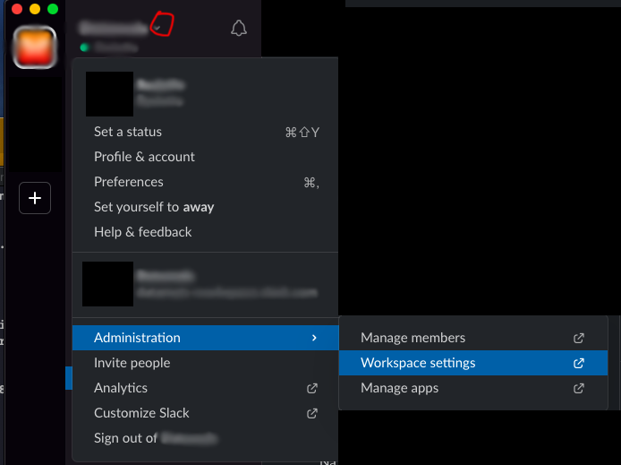
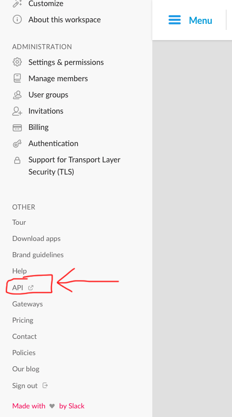
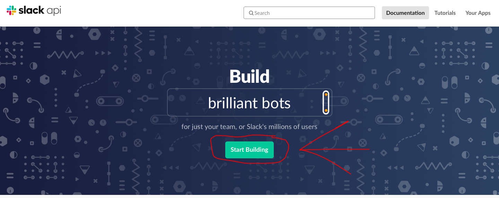
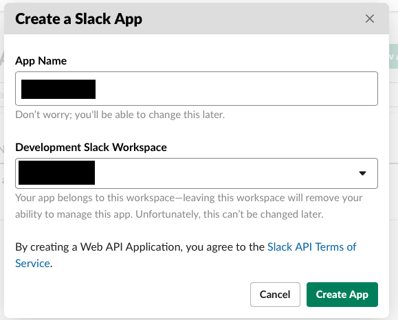
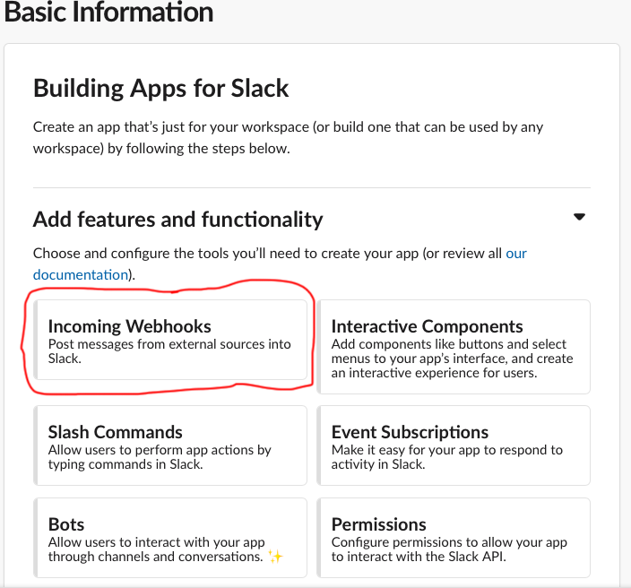
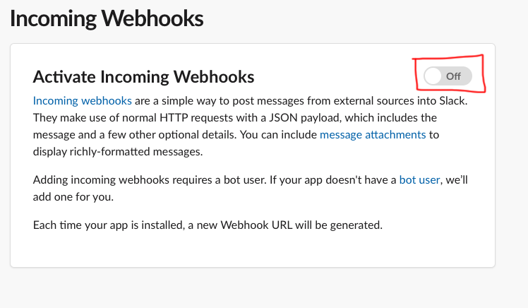
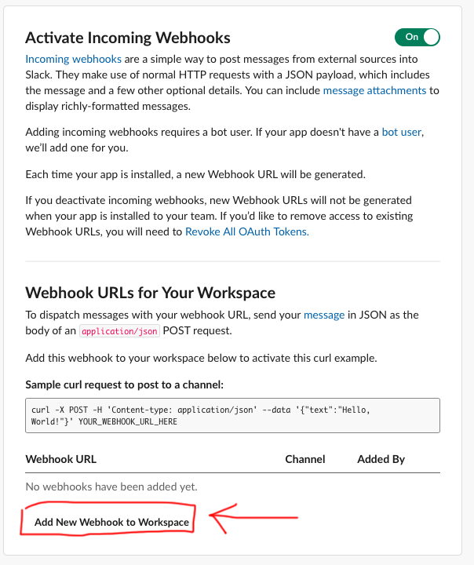
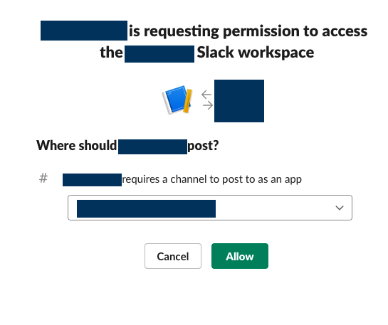
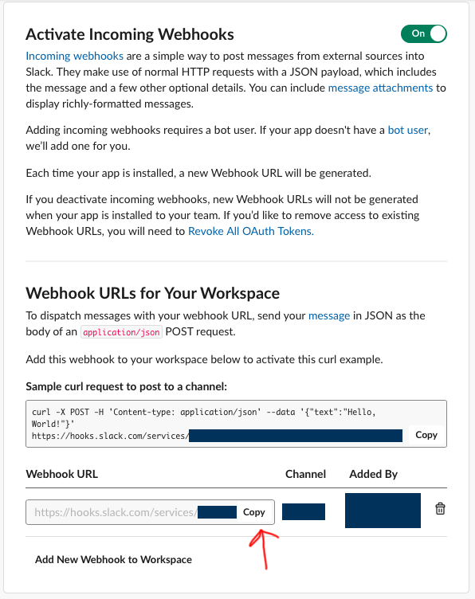

<h1>Laravel parte 10</h1>

<strong>Referências:</strong>

- [Notifications](https://laravel.com/docs/6.x/notifications)

---

- Criar Class para envio de Notificação:

```bash
php artisan make:notification NewDev
```

- Será criado o arquivo `Notiffications\NewDev`

- Adicione as use :

```php
use Illuminate\Bus\Queueable;
use Illuminate\Contracts\Queue\ShouldQueue;
use Illuminate\Notifications\Messages\MailMessage;
use Illuminate\Notifications\Notification;
use Illuminate\Notifications\Messages\SlackMessage;
```

- Verifique se já não há todas elas para não duplicar.

- a classe também deverá implementar : `ShouldQueue`:

```php
class NewDev extends Notification implements ShouldQueue
```

- Altere o conteúdo da class para o seguinte:

```php
use Queueable;

    private $dev = [];

    /**
     * Create a new notification instance.
     *
     * @return void
     */
    public function __construct($dev)
    {
        $this->dev = $dev;
    }

    /**
     * Get the notification's delivery channels.
     *
     * @param  mixed  $notifiable
     * @return array
     */
    public function via($notifiable)
    {
        return ['slack'];
    }


    public function toSlack($notifiable)
    {
        $url = url('/invoices/' . 'a');
        return (new SlackMessage)
            ->image('https://laravel.com/img/favicon/favicon.ico')
            ->success()
            ->content('One of your invoices has been paid!')
            ->attachment(function ($attachment) use ($url) {
                $attachment->title('Invoice 1322', $url)
                    ->fields([
                        'Title' => 'Server Expenses2',
                        'Amount' => '$1,234',
                        'Via' => 'American Express2',
                        'Was Overdue' => ':-1:',
                    ]);
            });
    }

    /**
     * Get the mail representation of the notification.
     *
     * @param  mixed  $notifiable
     * @return \Illuminate\Notifications\Messages\MailMessage
     */
    public function toMail($notifiable)
    {
        return (new MailMessage)
            ->line('The introduction to the notification.')
            ->action('Notification Action', url('/'))
            ->line('Thank you for using our application!');
    }

    /**
     * Get the array representation of the notification.
     *
     * @param  mixed  $notifiable
     * @return array
     */
    public function toArray($notifiable)
    {
        return [
            //
        ];
    }
```

- Instale a biblioteca do para envio de msg para o slack:

```bash
composer require laravel/slack-notification-channel
```

- Na class `DevController`, adicione antes do `return` da function `store()`:

```php
Notification::route('slack', env('SLACK_HOOK'))
            ->notify(new NewDev($devs->toArray()));
```

- Também adicione ao arquivo a use: `use Illuminate\Support\Facades\Notification;` e `use App\Notifications\NewDev;`

---

<h2>Criando a aplicação no slack:</h2>

1 - No seu slack acesse `Workspace settings`



2 - Após abrir a página vá até o menu e encontre `API` e clique nele:



3 - Na página que aparece clique no botão conforme indicado:



4 - Na tela seguinte clique em `Create New App`


5 - No popup que aparece preencha as informações solicitadas:



6 - Na próxima tela selecione a opção conforme indicado:



7 - Ative a opção na tela que aparece:



8 - Clique na opção indicada para criar o webhook



9 - Na tela que aparece, selecione o canal e clique em `Allow`:



10 - Feito isso copie a url conforme indicado:



---

- No arquivo `.env`

- Crie uma chave: chamada `SLACK_HOOK` e cole o valor criado para ela:

`SLACK_HOOK="https://hooks.slack.com/services/TXXXXXXX/BXXXXXXX/XXXXXXXXXXXXXX"`

- Antes de testar vamos garantir que as informações do arquivo `.env` não estejam em cache, execute os comandos:

```bash
php artisan config:cache
```

- E também:

```bash
php artisan config:clear
```

- Por fim executar o comando para iniciar o serviço:

```bash
php artisan queue:work
```

- Para executar o serviço em produção siga os passos em:

[Supervisor Configuration](https://laravel.com/docs/6.x/queues#supervisor-configuration)

- Agora teste cadastrando um novo dev!
